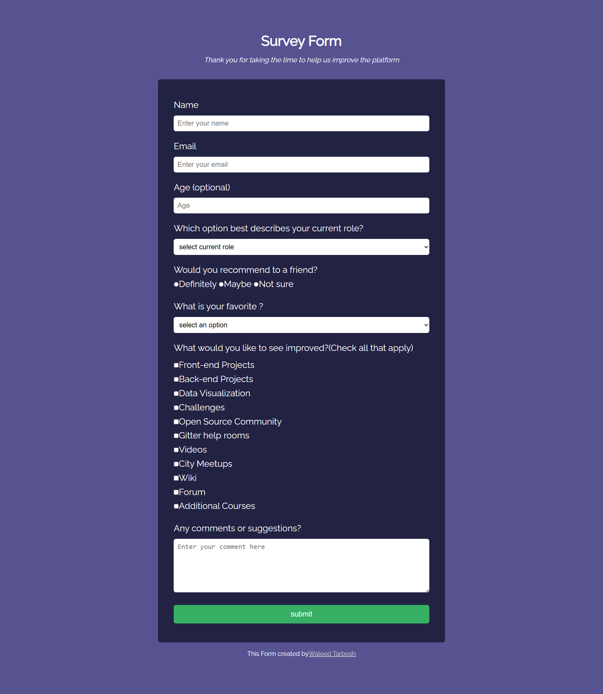

<h1 align="center">📝 Survey Form</h1>

<p align="center">
  <em>A clean, simple, and fully responsive survey form — crafted with HTML & CSS.</em>
</p>

<p align="center">
  
  
  
  
</p>

---

## 📖 Project Description

**Survey Form** is a clean and straightforward web form designed to collect user feedback. Built with **vanilla HTML5 & CSS3**, showcasing semantic markup and accessible form elements.

The website features a modern dark-themed card layout, neatly aligned input fields, dropdowns, radio buttons, and checkboxes, along with a fully responsive layout that adapts beautifully from desktop to mobile.

> 💡 **Why this project stands out:** It demonstrates solid fundamentals in HTML form structure, CSS styling for form controls, and responsive design techniques ensuring a seamless user experience across all devices.

---

## 📸 Screenshots 🖼️

<div align="center">
  <table>
    <tr>
      <th align="center">🖥️ Desktop View</th>
      <th align="center">📱 iPad Pro</th>
      <th align="center">📲 iPhone 14 Pro Max</th>
    </tr>
    <tr>
      <td align="center"></td>
      <td align="center"></td>
      <td align="center"></td>
    </tr>
  </table>
</div>

---

## 📖 Table of Contents

- [🛠️ Technologies & Styles Used](#️-technologies--styles-used-)
- [✨ Core Features](#-core-features)
- [🚀 Installation Instructions](#-installation-instructions)
- [🎨 Design Decisions](#-design-decisions)

---

## 🛠️ Technologies & Styles Used 🎨

| Technology | Purpose | Details |
|:---:|:---|:---|
|  | **Structure** | Semantic HTML5 elements and comprehensive form controls |
|  | **Styling** | Custom form styling, color themes, and media queries |
|  | **Typography** | *Raleway* font for clean readability |

### 🎨 Design System

```text
🎨 Color Palette
├── Background     → #575391 (Main) / #222242 (Form Card)
├── Text           → #ffffff
├── Primary Button → #37AF65
└── Link Text      → #cccccc

🔤 Typography
├── Family         → 'Raleway', sans-serif
├── Headings       → 2.2rem
└── Body           → 1.1rem to 1.4rem
```

---

## ✨ Core Features

### 🎯 User Interface
- ✅ **Clean Dark Theme** with high contrast for readability
- ✅ **Organized Form Layout** with distinct input groups
- ✅ **Custom Styled Submit Button** with clear call to action

### 📱 Responsive Design
- ✅ **Fluid Container Width** up to 750px
- ✅ **Mobile-Optimized Padding & Margins** for smaller screens
- ✅ **Full-Width Input Fields** adapting to device width

### 📝 Form Elements
- ✅ **Text Inputs & Email Validation**
- ✅ **Number Inputs** for age
- ✅ **Dropdown Menus (`<select>`)** for roles and preferences
- ✅ **Radio Buttons & Checkboxes** for multiple choices
- ✅ **Textarea** for comments

---

## 🚀 Installation Instructions

**1. Clone the repository:**
```bash
git clone https://github.com/waleedtarbosh/Survey-Form.git
```

**2. Navigate to the project directory:**
```bash
cd Survey-Form
```

**3. Open in your browser:**
Simply open the `index.html` file in any modern web browser to view the form.

---

## 🎨 Design Decisions

| Decision | Rationale |
|:---|:---|
| **Pure HTML & CSS** | Keeps the project lightweight and fast-loading |
| **Centered Card Layout** | Focuses the user's attention directly on the form fields |
| **Raleway Font** | Provides a modern, friendly, and highly legible text experience |

---

## ✍️ Author

<p align="center">
  <a href="https://github.com/waleedtarbosh">
    
  </a>
</p>

<p align="center">
  <strong>Waleed Tarbosh</strong><br/>
  Front-End Developer
</p>

---

<p align="center">
  <a href="#-survey-form">⬆️ Back to Top</a>
</p>
